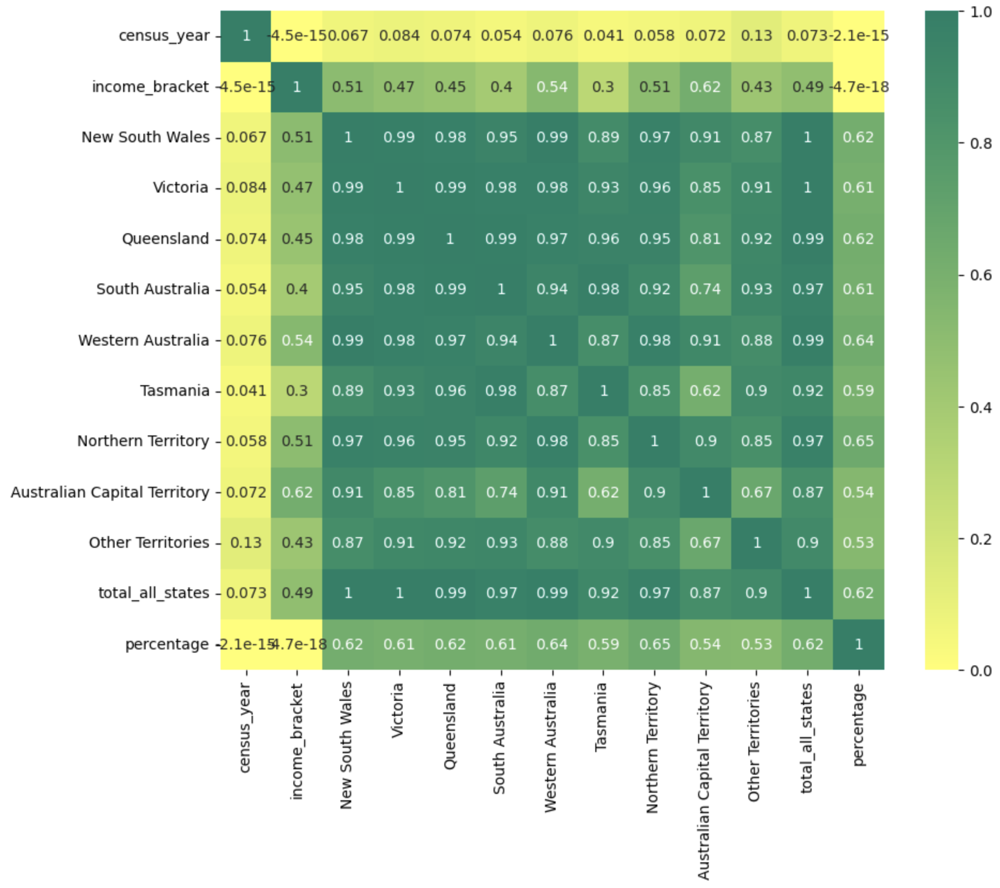

# Gathering Creative Insights about Australia by analysing Australian Bureau of Statistics (ASB) Census Data (from 2011 until 2021)Utilising Data Analysis and Visualization Techniques.

**<u>Project Overview</u>**

The Australian Bureau of Statistics (ASB) is a National Organization of
Australia which collects and provides authentic, dependable data-facts
every 5 years also known as the Census about numerous aspects like
Population, Immigration, Economics, Housing, and Social-Cultural
constitute of Australia (Australian Bureau of Statistics, n.d.). The
Census is an accumulated snapshot of data that informs and assists
government departments, public planners, and stakeholders in planning
and strategizing abundant services and infrastructures such as health
care, schools, housing, transport etc. while encouraging them to make
informed decisions (Australian Bureau of Statistics, n.d.).

To facilitate data analysis and visualization learning, the datasets are
downloaded from Census year 2011 until 2021 and are available at ASB
Data packs:
https://www.abs.gov.au/census/find-censusdata/datapacks?release=2021&product=GCP&geography=ALL&header=S

**Business Problem**

Analyse the evolution of Australia as a nation relating to features like
families/person’s income, and migration (foreign born) from different
countries from 2011 until 2021. Also, investigate if any trends
highlighting the significance of the country and impacting how it has
changed.

**Business Question**

The analysis will cover below (the period of 3 censuses 2011, 2016 and
2021):

Income:

-   Which are the states in Australia to which top income earners
    belong?

-   How did families (couple and single parent) perform during this
    census period?

-   Which income bracket shows the best performance?

-   How have income levels changed throughout this period?

Migration:

-   From which countries people migrated the most to Australia?

-   Which are the top states in Australia where migrants prefer to
    settle?

-   Is there any noticeable trend in immigration from various countries
    around the world?

**<u>Datasets</u>**

The ASB dataset consists of comprehensive (aggregated) data in multiple
files about numerous features. The below figure shows the original files
downloaded from the ASB source data packs.

Figure 1: Original files downloaded from the ASB data pack.

For analysis purposes, only the data about required features of income
and immigration files are read and combined in separate single datasets
for income and migration. The below table provides information on
various characteristics of the 1) income and 2) migration datasets.

 Table 1: Details of
various characteristics of the income and migration datasets.

The below shows the sampling of records from the datasets.

Table 2: The above are sample of 5 rows from the income dataset

Table 3: The above are sample of 5 rows from the migration dataset

**<u>Data Preparation</u>**

The data read from the ASB source is in aggregated form to deidentify
people for privacy purposes, so it was essential to prepare the income
and migration data before analysis. Below is the sample of original data
read from the ASB source.

Table 4: The above are sample of 5 rows from the original income dataset

Table 5: The above are sample of 5 rows from the original migration
dataset

To process the above-read income and migration aggregated data, the
following three functions are created which will assist in preparing and
arranging the data in a meaningful shape for analysis.

-   add\_year(value):

> The census year information in the data is in form of the attribute
> value of the index/Type\_Value column, for example, if the value is
> “C11\_” or “C21\_” it means the census year is 2011 and 2021
> respectively. To extract this census year information, the add\_year()
> function is created.

-   add\_family\_status(value):

> The wage earners are considered to be of two family status/types:
> couple families and single-parent families and it is present in the
> index/Type\_Value column as “\_1PF\_” or “\_CF\_” informing Single
> Parent and Couple families. Thus, to derive this data
> add\_family\_status() function is applied.

-   add\_income\_brackets(value):

> There are various income brackets starting from 149 to 4000 and again
> are present in the index/Type\_Value column. Except for 4000, all the
> salary brackets are described as “up to 149” and “up to 299” whereas
> it’s “4000 and more” for the last income bracket. So, to draw this
> information add\_income\_brackets() function is generated.

 Table 6: Details of
various methods used for the preparation of the income and migration
datasets.

Additionally, to generate a world map to show the birth country of
migrants, the country’s ISO code is necessary and this data was
downloaded from https://plotly.com/python/choropleth-maps/and is merged
as a new column “iso\_code” with the migration dataset.

Further, different functions (head, tail, sample, info, shape) and
statistical methods (describe) are used to understand the data points
information of both datasets. Please check the 1st,
2nd and 6th sections of the iPython notebook.

**Missing Value Exploration**

Figure 1: Income dataset’s heatmap.

Figure 2: Migration dataset’s heatmap.

The above Heatmaps, used in the 4th section of the iPython
notebook, demonstrate if any missing values are present in the datasets.
The income dataset doesn’t have any missing values, however, there are
missing values in the iso\_code (abbreviations of countries) attribute
of the migration dataset and would only be used to generate a world map.

**Outlier Identification**

The outliers in the numeric attributes of the income and migration
dataset involve the number of families’ earnings (in various salary
brackets) and the migration of people from around the world to different
states of Australia as represented and explained in section 7 of the
iPython notebook (or pdf result) using box plots. For instance, outliers
from numeric attributes 'New South Wales' of income and ‘Victoria’ of
migration datasets are represented below.

Figure 3: Outliers in the income dataset’s 'New South Wales' attribute.

Figure 2: Outliers in the 'Victoria' attribute of the migration dataset.

Reserving the extreme values in both datasets as they explain an
elevated number of families’ earnings and a rise in immigration to
different states of Australia from 2011 until 2021.

**<u>Data Analysis and Visualisation</u>**

Section 8 from the iPython notebook (or pdf result) describes and
explains different data visualization graphs for various purposes. Below
are some examples of graphs used in the income and migration dataset
analysis.

a\) Bar graphs to understand the distribution of values of categorical
and numeric attributes.

Figure 3: Distribution of data points using bar plots of family\_status
and income\_bracket attributes of income dataset.

Figure 4: Distribution of the average number of migrants for 3 censuses
from 2011 until 2021 of migration dataset.

b\) Pie graphs to show the composition of values of the attributes.

Figure 5: Composition of data points using pie plots of different
income\_brackets for 3 censuses of the income dataset.

c\) Scatter graphs for identifying the relationship between various
numeric and categorical attributes.

Figure 6: Scatter plot showing immigrants settling in different states
of Australia from across the globe during census 2021.

d\) Pair plots, associating best attributes while describing a
relationship.

Figure 7: Pair plot identifying best columns for explaining a
relationship of attributes of income dataset.

Please refer to sections 8.1 and 8.2 of the iPython notebook (or pdf
result) for detailed data visualization presenting information and
insights about income and migration datasets respectively.

**<u>Conclusion</u>**

**Income:**

NSW, Victoria and Queensland are the top states where the highest number
of salaried workers reside. While the ratio of single-parent families'
income has improved compared to couple families. In 2011 and 2016, the
best performing two salary brackets were 1499 and 1999, however, in 2021
it jumped and shifted to 4000(and more) and 3999 income brackets. The
number of families' earnings in various income groups was almost similar
in the 2011 and 2016 censuses as compared, in 2021 majority of the
families' income earners are from higher income brackets.

**Migration:**

During the period from 2011 until 2021, a large number of migrants are
from China and India. NSW, Victoria and Queensland are the top choices
among all migrants for 3 censuses, where Indians prefer Victoria, in
contrast, Chinese and British people preferred NSW. Queensland is the
favourite destination for people migrating from New Zealand.

 

Please check section 8th of the iPython notebook (or pdf result) for
detailed observations using various data visualization plots.

**Prerequisites**

-   Python 3.7+

-   Matplotlib

**Techniques Employed**

-   Exploratory Data Analysis with Python Programming Features

-   Data Visualisation

**Kindly review the information from**

-   Detailed Analysis Python Notebook -&gt; under analysis directory

-   Analysis Report -&gt; under report Directory

<small>Project based on the <a target="_blank" href="https://drivendata.github.io/cookiecutter-data-science/">cookiecutter data science project template</a>. #cookiecutterdatascience</small>

Project Organization
------------

    ├── LICENSE
    ├── Makefile           <- Makefile with commands like `make data` or `make train`
    ├── README.md          <- The top-level README for developers using this project.
    ├── data
    │   ├── external       <- Data from third party sources.
    │   ├── interim        <- Intermediate data that has been transformed.
    │   ├── processed      <- The final, canonical data sets for modeling.
    │   └── raw            <- The original, immutable data dump.
    │
    ├── attachments        <- Images and diagrams form README.md
    │
    ├── notebooks          <- Data-Analysis-Visualization-On-ABS-Census-Data.ipynb                                        
    │
    ├── reports            <- Data-Analysis-Visualization-On-ABS-Census-Data.pdf
    │                      <- Final Project Report.pdf
    │
    └── requirements.txt   <- The requirements file for reproducing the analysis environment, 
                              e.g. generated with `pip freeze > requirements.txt`

